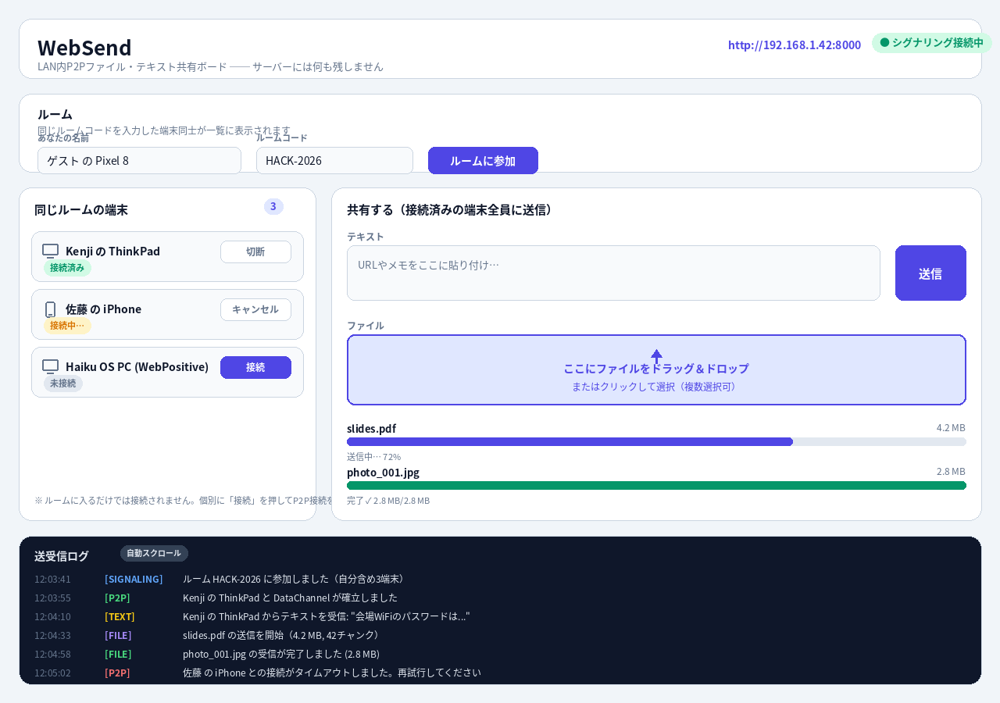

# WebSend UI設計仕様

`design.png` の完成予想図に対応するUI要素仕様。実装は `index.html` 1ファイル（Vanilla JS + Tailwind CDN）で行う。

## 画面構成（単一ページ／1画面完結）

上から順に、①ヘッダー、②ルーム参加パネル、③（左）端末一覧 / （右）共有パネル、④送受信ログ、の4ブロックを縦に並べる。モーダルや画面遷移は作らない。

---

## ① ヘッダー

| 要素 | 内容 |
|---|---|
| タイトル | `WebSend` |
| サブテキスト | `LAN内P2Pファイル・テキスト共有ボード ── サーバーには何も残しません` |
| 自分のアクセスURL | `http://<host-ip>:8000` を表示。`window.location.origin` から取得し、他端末に口頭/QRで伝える用途。 |
| シグナリング接続ステータス pill | WebSocket接続状態を表示。 |

**ステータスpillの状態:**

| 状態 | ラベル | 色 |
|---|---|---|
| 接続中 | `● シグナリング接続中` | emerald |
| 切断/再接続中 | `● 再接続中…` | amber |
| 接続失敗 | `● 未接続` | red |

---

## ② ルーム参加パネル

| 要素 | 種別 | 説明 |
|---|---|---|
| あなたの名前 | テキスト入力 | 初期値は `navigator.userAgent` から推測した端末名 + ランダムsuffix（例: `Pixel 8 の訪問者`）。編集可能。他端末の一覧に表示される表示名になる。 |
| ルームコード | テキスト入力 | 同じ文字列を入力した端末同士が「同じルームの端末」一覧に表示される。初期値は空、または直近使用したコードを `localStorage` から復元。 |
| 「ルームに参加」ボタン | ボタン（primary / indigo） | WebSocket `/ws/{room}` に接続し、`join`メッセージを送る。参加後はボタンラベルが `退出` に変わり、入力欄はdisabledになる。 |

**バリデーション:** ルームコード未入力時はボタンをdisabledにする。名前は必須（未入力なら送信不可）。

---

## ③-左 同じルームの端末一覧

- ヘッダーに現在の参加人数を示すバッジ（自分を含む合計）。
- 各行＝1端末のカード。自分自身の行は表示しない。
- **端末アイコン**: 絵文字は使わずシンプルな線画アイコンを使用（PC＝角丸長方形＋台座の線、スマホ＝縦長角丸長方形）。UAから `pc` / `phone` を判定し、判定不能時は `pc` 扱い。
- **端末名**: ルーム参加時に入力した名前。
- **接続ステータスpill**:

  | 状態 | ラベル | 色 |
  |---|---|---|
  | 未接続 | `未接続` | slate |
  | 接続試行中 | `接続中…` | amber |
  | 接続済み | `接続済み` | emerald |
  | 失敗 | `接続失敗` | red |

- **アクションボタン**（右端）:
  - 未接続 → `接続`（primary）: クリックでRTCPeerConnectionを作成しofferを送信。
  - 接続中 → `キャンセル`（secondary）: 接続試行を中断。
  - 接続済み → `切断`（secondary）: DataChannel/PeerConnectionをclose。
- 一覧は新規参加/離脱をリアルタイムに反映する（WebSocketの `peer-joined` / `peer-left` メッセージで再描画）。
- フッター注記: 「ルームに入るだけでは接続されません。個別に『接続』を押してP2P接続を開始します」

---

## ③-右 共有パネル

見出し: `共有する（接続済みの端末全員に送信）`。**接続済み端末が1つもない場合、テキスト送信ボタン・ドロップゾーンはdisabled表示にし、その旨の注記を出す。**

### テキスト共有
- 複数行テキストエリア（プレースホルダー: `URLやメモをここに貼り付け…`）。
- 「送信」ボタン（primary）: 接続済みの全ピアのDataChannelに対しテキストメッセージを送信し、自分のログにも「送信」として記録。送信後テキストエリアはクリア。
- Enterで改行、`Cmd/Ctrl+Enter`で送信（ショートカット）。

### ファイル共有
- ドラッグ＆ドロップゾーン（点線ではなく塗り＋実線ボーダー、indigo系）。
  - 上向き矢印アイコン（Pillow描画と同様、Unicode矢印や絵文字ではなくSVGアイコンを使用）＋ `ここにファイルをドラッグ＆ドロップ` ＋ `またはクリックして選択（複数選択可）`。
  - クリックで `<input type="file" multiple>` を発火。
  - `dragover`時はボーダー色を濃くするなどの視覚フィードバック。
- 選択/ドロップされたファイルはリスト化され、各項目に以下を表示:
  - ファイル名（bold）／ファイルサイズ（右寄せ、`KB`/`MB`単位に整形）
  - 進捗バー（トラックはslate-200、進捗色は状態により変化）
  - 状態ラベル（進捗バー下、小文字）:

    | 状態 | ラベル例 | バー色 |
    |---|---|---|
    | 送信中 | `送信中… 72%` | indigo |
    | 完了 | `完了 ✓ 2.8 MB/2.8 MB` | emerald |
    | 失敗 | `失敗（相手が切断しました）` | red |
    | 受信中 | `受信中… 45%（Kenji の ThinkPad から）` | indigo |
- 複数ピアが接続済みの場合、ファイルは全員にブロードキャスト送信する（ピア数分のDataChannelへ並行送信）。
- 受信したファイルは自動的にブラウザのダウンロードとして保存（`URL.createObjectURL` + `<a download>` を動的クリック）。

---

## ④ 送受信ログ

- ダークパネル（slate-900背景）で他ブロックと視覚的に区別。
- ヘッダーに `送受信ログ` タイトル＋ `自動スクロール` トグルpill（既定ON。OFFなら新着があっても位置維持）。
- 各行フォーマット: `HH:MM:SS` （タイムスタンプ、slate-500） + `[カテゴリタグ]`（色分け） + メッセージ本文。
- **カテゴリタグと色:**

  | タグ | 意味 | 色 |
  |---|---|---|
  | `[SIGNALING]` | ルーム参加/離脱、WebSocket接続状況 | blue |
  | `[P2P]` | PeerConnection/DataChannelの確立・切断・失敗 | green（成功）/ red（失敗） |
  | `[TEXT]` | テキストの送受信 | yellow |
  | `[FILE]` | ファイルの送受信開始・進捗・完了 | purple |

- 最大保持件数: 200件（超過分は古い順に破棄。メモリ節約、サーバー保存はしない＝あくまで브라우저内の揮発ログ）。
- ログはページリロードで消える（意図的：永続化しない設計方針に合わせる）。

---

## レスポンシブ方針

- デスクトップ（≥1024px）: design.png通り2カラム（左: 端末一覧 / 右: 共有パネル）。
- タブレット/スマホ（<1024px）: 1カラムに変更し、上から「ヘッダー→ルーム→端末一覧→共有パネル→ログ」の縦積みにする（Tailwindの `lg:grid-cols-[380px_1fr]` → デフォルトは `grid-cols-1` )。
- Haiku OS WebPositiveでの描画を優先し、CSS Grid/Flexboxの基本機能のみ使用（`gap`, `rounded-*`, `backdrop-blur`等の新しめのCSS機能は避けるか、フォールバックを用意する）。

## 配色（Tailwind前提のトークン）

| 用途 | クラス例 |
|---|---|
| 背景 | `bg-slate-100` |
| カード | `bg-white border border-slate-300 rounded-2xl` |
| 主要アクション | `bg-indigo-600 text-white` |
| 成功/接続済み | `bg-emerald-100 text-emerald-600` |
| 警告/進行中 | `bg-amber-100 text-amber-600` |
| 危険/失敗 | `bg-red-100 text-red-600` |
| ログパネル | `bg-slate-900 text-slate-200` |

## アイコン方針

絵文字（Emoji）はHaiku OS WebPositive等のフォント環境で表示が不安定なため使用しない。アイコンは以下のいずれかで表現する:
1. インラインSVG（線画、`currentColor`で色継承）
2. CSS/border による幾何学図形（今回のdesign.png生成と同様のアプローチ）
